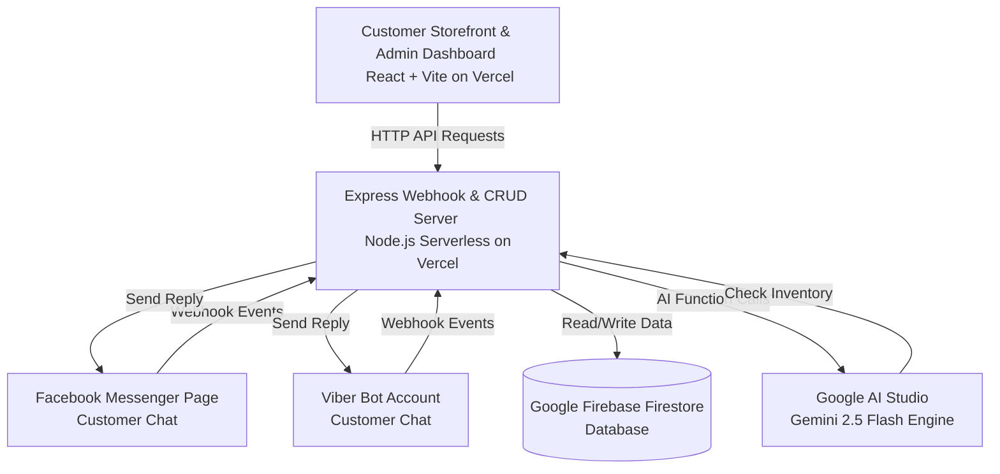

# YVRA Store System Documentation & Deployment/Setup Guide

ဤလမ်းညွှန်ချက်သည် YVRA Online Store ၏ နည်းပညာပိုင်းဆိုင်ရာ ဖွဲ့စည်းတည်ဆောက်ပုံ၊ ချိတ်ဆက်ထားသော အကောင့်များနှင့် Secret Keys အသေးစိတ်များ၊ **Vercel Deployment လုပ်ဆောင်ပုံအဆင့်ဆင့်**၊ **Facebook Webhook ချိတ်ဆက်ပုံ**၊ **Facebook App ကို Test (Development) အဆင့်မှ Production (Live) အဆင့်သို့ ပြောင်းလဲချိတ်ဆက်ပုံ**၊ **Viber Bot ချိတ်ဆက်ပုံ**၊ **Custom Domain ချိတ်ဆက်ပုံ** နှင့် **Admin User Guide** တို့ကို အစအဆုံး အသေးစိတ် မှတ်တမ်းတင်ထားခြင်း ဖြစ်ပါသည်။

---

## Part 1: စနစ်တစ်ခုလုံး၏ ဖွဲ့စည်းပုံ (System Architecture)

YVRA Platform ကို ခေတ်မီပြီး လျင်မြန်သော Serverless နည်းပညာများဖြင့် တည်ဆောက်ထားပြီး အစိတ်အပိုင်း ၆ ခု အပြန်အလှန် ချိတ်ဆက်လုပ်ဆောင်ကြသည်-



### ၁။ Frontend (စတိုးဆိုင်မျက်နှာစာနှင့် Admin Control)
- **Technology:** React.js (Vite)
- **Hosting:** Vercel Static Hosting (`https://yvra-2026.vercel.app/`)
- **လုပ်ဆောင်ချက်:** သုံးစွဲသူများအတွက် အထည်များကို လှပဆန်းသစ်သော Floral Blossom Theme ဖြင့် ပြသခြင်း၊ အဝတ်အစားများ၏ အရောင်အလိုက် အဝိုင်း (Color swatches) နှင့် size များ ပြသခြင်း၊ စတိုးဆိုင်အချက်အလက်ပြသခြင်းနှင့် လျှို့ဝှက် Admin Dashboard ထဲသို့ ဝင်ရောက်ခွင့်ပြုခြင်း။

### ၂။ Backend (ဗဟိုဆာဗာ)
- **Technology:** Node.js + Express.js
- **Hosting:** Vercel Serverless Function (`https://yvra-backend.vercel.app/`)
- **လုပ်ဆောင်ချက်:** Admin များအတွက် Product CRUD (ပေါင်း/ပြင်/ဖျက်) APIs များကို စီမံပေးခြင်း၊ Facebook Messenger / Viber မှ ဝင်လာသော စာများကို လက်ခံစစ်ဆေးပြီး AI (Gemini) သို့မဟုတ် Static Auto-replies ဖြင့် စာပြန်ပေးခြင်း။

### ၃။ Database (ဒေတာဘေ့စ်)
- **Technology:** Google Firebase Cloud Firestore
- **လုပ်ဆောင်ချက်:** ပစ္စည်းစာရင်း (Products Inventory)၊ variants အချက်အလက်များ၊ ဝယ်ယူသူများ၏ အချက်အလက်နှင့် Chat logs များကို စနစ်တကျ သိမ်းဆည်းပေးခြင်း။

### ၄။ AI Engine (ဉာဏ်ရည်တု စနစ်)
- **Technology:** Google AI Studio (Gemini 2.5 Flash Model)
- **လုပ်ဆောင်ချက်:** ဝယ်ယူသူများ စာမေးလာပါက စာကိုနားလည်ပြီး Real-time Database ထဲသို့ ဝင်ရောက်စစ်ဆေးကာ (Function Calling tools ဖြင့်) ပစ္စည်းရှိမရှိ၊ အရောင်နှင့် size မည်မျှကျန်ရှိသည်ကို မြန်မာလို ယဉ်ကျေးစွာ အလိုအလျောက် စာပြန်ပေးခြင်း။

---

## Part 2: Vercel Deployment လုပ်ဆောင်ပုံ အဆင့်ဆင့် (Vercel Setup)

စနစ်တစ်ခုလုံးကို Vercel ပေါ်တွင် Project နှစ်ခုခွဲ၍ တင်ထားခြင်း ဖြစ်ပါသည်။

### ၁။ Backend Project (`yvra-backend`) တည်ဆောက်ခြင်း
Backend သည် Node.js/Express.js server အဖြစ် အလုပ်လုပ်ပါသည်။

1. **GitHub ချိတ်ဆက်ခြင်း:**
   - Vercel Dashboard သို့ သွားပြီး **Add New...** -> **Project** ကို နှိပ်ပါ။
   - သင်၏ GitHub Repository ဖြစ်သော `testforme2026/YVRA2026` ကို Vercel နှင့် ချိတ်ဆက်ပါ။
2. **Build Settings ချိန်ညှိခြင်း:**
   - Project Name ကို `yvra-backend` ဟု ပေးပါ။
   - **Root Directory:** `./` (Repository root တိုက်ရိုက်ဖြစ်ရမည်)။
   - **Framework Preset:** `Other` ဟု ရွေးချယ်ပါ။
   - Build command နှင့် Output directory များကို အလွတ်ထားပါ။
3. **Environment Variables များ ထည့်သွင်းခြင်း:**
   - **Settings** -> **Environment Variables** သို့ သွားပြီး အောက်ပါ variables များကို ထည့်သွင်းပါ။
     - `GEMINI_API_KEY` = *[သင့် Google AI Studio API Key]*
     - `MESSENGER_VERIFY_TOKEN` = `yvra_bot_secret_123`
     - `MESSENGER_ACCESS_TOKEN` = *[Facebook Page Access Token]*
     - `VIBER_AUTH_TOKEN` = *[Viber Bot App Token]*
     - `FIREBASE_PROJECT_ID` = `yvra-bot`
     - `FIREBASE_SERVICE_ACCOUNT` = *[သင့် serviceAccountKey.json ဖိုင်တစ်ခုလုံးထဲက စာသားများကို copy ယူပြီး ထည့်သွင်းပါ]*
4. **Deploy ခလုတ်ကို နှိပ်ပါ။** Vercel မှ `vercel.json` ဖိုင်ပါ rewrite rules များကို ဖတ်ပြီး `/api/index.js` ကို Serverless function အဖြစ် deploy လုပ်သွားပါမည်။

### ၂။ Frontend Project (`yvra-2026`) တည်ဆောက်ခြင်း
Frontend သည် React.js Static App အဖြစ် အလုပ်လုပ်ပါသည်။

1. **Project အသစ်ထည့်ခြင်း:**
   - Vercel Dashboard တွင် **Add New...** -> **Project** ကို နှိပ်ပြီး `testforme2026/YVRA2026` ရေပိုကို ထပ်မံရွေးချယ်ပါ။
2. **Build Settings ချိန်ညှိခြင်း:**
   - Project Name ကို `yvra-2026` ဟု ပေးပါ။
   - **Root Directory:** **`dashboard`** ဟု သတ်မှတ်ပေးရပါမည်။ *(ဤအချက်သည် အလွန်အရေးကြီးပါသည်၊ dashboard root directory ဖြစ်မှသာ Vite React app ကို build လုပ်နိုင်မည်ဖြစ်သည်)*။
   - **Framework Preset:** `Vite` ဟု အလိုအလျောက် ရွေးချယ်ပေးပါလိမ့်မည်။
3. **Environment Variables ထည့်သွင်းခြင်း:**
   - **Settings** -> **Environment Variables** သို့ သွားပြီး အောက်ပါ variable ကို ထည့်သွင်းပါ။
     - `VITE_API_URL` = `https://yvra-backend.vercel.app` *(နောက်ဆုံးတွင် `/` မပါစေရ)*
4. **Deploy ခလုတ်ကို နှိပ်ပါ။** Vite မှ builds လုပ်ပြီး website ကို static files အဖြစ် deploy လုပ်ပေးသွားပါမည်။

---

## Part 3: Facebook Webhook ချိတ်ဆက်ပုံ အဆင့်ဆင့် (Facebook Setup)

Chatbot ကို သင့် Facebook Page တွင် စာပြန်စေရန် Facebook Developer Console တွင် အောက်ပါအတိုင်း ချိန်ညှိရပါမည်-

### ၁။ Facebook Developer App တည်ဆောက်ခြင်း
1. **[Facebook for Developers](https://developers.facebook.com/)** သို့ သွားပြီး သင့်အကောင့်ဖြင့် Login ဝင်ပါ။
2. **My Apps** -> **Create App** ကို နှိပ်ပါ။
3. App Type တွင် **Other** -> **Consumer** သို့မဟုတ် **Business** ကို ရွေးချယ်ပါ။
4. App Display Name ပေးပြီး **Create App** ကို နှိပ်ပါ။

### ၂။ Messenger Product ထည့်သွင်းခြင်း
1. App Dashboard တွင် **Add a product** သို့ သွားပြီး **Messenger** အောက်ရှိ **Set Up** ကို နှိပ်ပါ။
2. Messenger setting စာမျက်နှာတွင်:
   - **Access Tokens:** နေရာ၌ **Add or remove pages** ကို နှိပ်ပြီး သင့်ရဲ့ YVRA Facebook Page ကို ရွေးချယ်ချိတ်ဆက်ပါ။
   - ချိတ်ဆက်ပြီးပါက ၎င်း Page ၏ ဘေးတွင် **Generate Token** ခလုတ် ပေါ်လာပါလိမ့်မည်။ ၎င်းကို နှိပ်ပြီး ရလာသော **Page Access Token** ကို Vercel Backend settings တွင် `MESSENGER_ACCESS_TOKEN` အဖြစ် သွားရောက်သိမ်းဆည်းပါ။

### ၃။ Webhooks ချိန်ညှိခြင်း (Callback URL ချိတ်ခြင်း)
1. Messenger setting စာမျက်နှာ၏ **Webhooks** အပိုင်းတွင် **Add Callback URL** ကို နှိပ်ပါ။
2. အောက်ပါအတိုင်း ဖြည့်သွင်းပါ-
   - **Callback URL:** `https://yvra-backend.vercel.app/webhook/messenger`
   - **Verify Token:** `yvra_bot_secret_123`
3. **Verify and Save** ကို နှိပ်ပါ။
4. **Page Subscriptions:**
   - Webhooks အောက်တွင် သင့် Page ဘေးရှိ **Manage** သို့မဟုတ် **Subscribe** ခလုတ်ကို နှိပ်ပါ။
   - ၎င်းထဲတွင် **`messages`** နှင့် **`messaging_postbacks`** event များကို အမှန်ခြစ်ရွေးချယ်ပြီး **Save** လုပ်ပါ။

---

## Part 4: Facebook App ကို Test (Development) အဆင့်မှ Production (Live) အဆင့်သို့ ပြောင်းလဲချိတ်ဆက်ပုံ (Test to Production Migration)

Facebook Developer App စနစ်တွင် App တစ်ခုလုံးကို ပိုမိုလုံခြုံစိတ်ချစွာ စမ်းသပ်နိုင်ရန်နှင့် Production (တကယ်သုံးမည့်နေရာ) သို့ လွှဲပြောင်းနိုင်ရန် အဆင့်နှစ်ဆင့်ဖြင့် လုပ်ဆောင်နိုင်ပါသည်-

### ၁။ Test App (စမ်းသပ်ရန် App) နှင့် Production App ခွဲခြားအသုံးပြုပုံ
စနစ်ကို စတင်စမ်းသပ်ချိန်တွင် live ဖြစ်နေသော YVRA main page ကို မထိခိုက်စေရန် Facebook Developer Console တွင် Test App တစ်ခုကို သီးခြားခွဲထုတ်၍ စမ်းသပ်နိုင်ပါသည်။
1. **Test App ဖန်တီးခြင်း:**
   - Facebook Developers Console ရှိ သင့် Main App Dashboard ထိပ်ဆုံးဘယ်ဘက်ဘားရှိ App အမည်ဘေးမှ မျှားလေးကိုနှိပ်ပြီး **"Create Test App"** ကို နှိပ်ပါ။
   - ၎င်းသည် Main App ၏ settings များကို ကော်ပီကူးယူပြီး Test App တစ်ခု (ဥပမာ - `Test-App-YVRA-Store`) အဖြစ် ဖန်တီးပေးမည်ဖြစ်ပြီး ၎င်းတွင် သီးခြား App ID ရှိပါမည်။
2. **စမ်းသပ်မှု ပတ်ဝန်းကျင် တည်ဆောက်ခြင်း (Test Environment):**
   - **Test Facebook Page:** Facebook တွင် Test လုပ်ရန် သီးခြား Page အဟောင်း သို့မဟုတ် စမ်းသပ် Page အသစ်တစ်ခု ဖွင့်ပါ။
   - **Test Webhook / Backend:** Vercel ပေါ်တွင် test backend deploy လုပ်ထားပါက ၎င်း test URL ကို Test App webhooks callback တွင် ချိတ်ဆက်ပါ။
   - **Test Access Token:** Test App setting ထဲရှိ Messenger တွင် Test Page ကို ချိတ်ဆက်ပြီး ရရှိလာသော **Page Access Token** ကို test server variables တွင် ထည့်သွင်းပါ။
   - **စမ်းသပ်ခြင်း:** Test App သည် Development mode တွင်သာ အမြဲရှိနေမည်ဖြစ်ပြီး App Roles ထဲတွင် သတ်မှတ်ထားသော Testers များသာ စာပို့ စမ်းသပ်နိုင်မည် ဖြစ်သည်။

---

### ၂။ Test (Development) အဆင့်မှ Production (Live) သို့ ကူးပြောင်းချိတ်ဆက်ပုံ အဆင့်ဆင့်
စမ်းသပ်မှုများ အဆင်ပြေ၍ စတိုးဆိုင်ကို ဝယ်ယူသူများအားလုံး တကယ်အသုံးပြုနိုင်ရန် Main App ကို အောက်ပါအတိုင်း ပြောင်းလဲချိန်ညှိရပါမည်။

#### အဆင့် ၁: Production Page Access Token ရယူပြီး Vercel တွင် အပ်ဒိတ်လုပ်ခြင်း
1. Facebook Developers Console တွင် **Main App (Production App)** Dashboard ထဲသို့ ဝင်ပါ။
2. **Messenger** -> **Settings** သို့ သွားပြီး **Access Tokens** အောက်တွင် **တကယ့် YVRA Customer Page** ကို ချိတ်ဆက်ပါ။
3. Page ဘေးရှိ **Generate Token** ကို နှိပ်ပြီး ရရှိလာသော token အသစ်ကို ကော်ပီယူပါ။
4. **Vercel Dashboard** ရှိ သင်၏ production backend (`yvra-backend`) settings -> **Environment Variables** သို့ သွားပြီး **`MESSENGER_ACCESS_TOKEN`** variable ၏ တန်ဖိုးကို ယခု ရလာသော Production Token အသစ်ဖြင့် ပြောင်းလဲပြီး Save လုပ်ပါ။
5. *အရေးကြီးချက်:* Vercel variables များ ပြောင်းလဲပြီးပါက ပြောင်းလဲမှုများ အသက်ဝင်စေရန် Vercel backend ကို **Redeploy** (သို့မဟုတ် redeploy from dashboard deploy branch) လုပ်ပေးရန် လိုအပ်ပါသည်။

#### အဆင့် ၂: Production Webhook စာရင်းသွင်းခြင်း
1. Main App ၏ Messenger Setting တွင် Webhooks Callback URL နေရာ၌ သင့် Production Backend webhooks link (`https://yvra-backend.vercel.app/webhook/messenger`) ကို စနစ်တကျ ချိတ်ဆက်ပါ။
2. **Verify Token** တွင် `yvra_bot_secret_123` ကို ထည့်ပြီး Verify လုပ်ပါ။
3. သင့် Production Page ဘေးရှိ **Manage** သို့မဟုတ် **Subscribe** ကို နှိပ်ပြီး **`messages`** နှင့် **`messaging_postbacks`** event များကို အမှန်ခြစ်၍ **Save** ပါ။ (ဤအချက်သည် အလွန်အရေးကြီးသည်၊ မေ့ကျန်ခဲ့ပါက bot မှ စာပြန်မည်မဟုတ်ပါ)

#### အဆင့် ၃: Production App Settings အခြေခံများ ဖြည့်စွက်ခြင်း
Main App ကို Live မုဒ်သို့ မပြောင်းမီ အောက်ပါ အချက်အလက်များ မဖြစ်မနေ လိုအပ်သည်-
1. App Settings -> **Basic** သို့ သွားပါ။
2. **Privacy Policy URL** နေရာတွင် သင့် website ၏ privacy policy link (ဥပမာ - `https://yvra-2026.vercel.app/privacy`) ကို ထည့်ပါ။ (လတ်တလော privacy page မရှိသေးပါက မည်သည့် website link ကိုမဆို ယာယီထည့်ထားနိုင်သည်)
3. **App Icon** (YVRA logo) တင်ပါ။
4. **Category** တွင် `Business and Pages` ကို ရွေးချယ်ပြီး Save လုပ်ပါ။

#### အဆင့် ၄: App Review တင်သွင်းခြင်း (pages_messaging Advanced Access ရယူခြင်း)
Development မုဒ်တွင် app roles ထဲရှိသူများသာ bot စာပြန်သည်ကို မြင်ရပြီး ပြင်ပလူများ မြင်နိုင်ရန် Facebook အဖွဲ့၏ review ကို တင်ရမည်။
1. **App Review** -> **Permissions and Features** သို့ သွားပါ။
2. **`pages_messaging`** ခွင့်ပြုချက်ကို ရှာပြီး ၎င်း၏ညာဘက်ရှိ **Request Advanced Access** ကို နှိပ်ပါ။
3. Bot ၏ အလုပ်လုပ်ပုံကို ရှင်းပြပါ (ဥပမာ - "ကျွန်ုပ်တို့၏ bot သည် Google Gemini AI ကို အသုံးပြု၍ customer များ မေးမြန်းသော အထည်ဒီဇိုင်းများ၊ အရောင်၊ size နှင့် ကျန်ရှိသော ပစ္စည်းအရေအတွက် စာရင်းများကို database ထဲတွင် အလိုအလျောက် စစ်ဆေးပြီး ပြန်လည်ဖြေကြားပေးရန် ဖြစ်ပါသည်")။
4. Bot စမ်းသပ်စာပြန်နေပုံ ဗီဒီယိုအတို (Screen record) တစ်ခုကို တင်ပြပါ။
5. **Submit for Review** ကို နှိပ်ပါ။ Facebook မှ ၁ ရက်မှ ၃ ရက်အတွင်း ခွင့်ပြုပေးပါလိမ့်မည်။

#### အဆင့် ၅: App ကို Live Mode သို့ ပြောင်းလဲခြင်း
1. Facebook မှ review အောင်မြင်ပြီး `pages_messaging` ကို Advanced Access ခွင့်ပြုချက် ပေးပြီးပါက Main App Dashboard ၏ ထိပ်ဆုံးဘားရှိ **App Mode** toggle ခလုတ်လေးကို နှိပ်ပါ။
2. **App Mode: Development** မှ **Live** သို့ ပြောင်းလဲပေးလိုက်ပါ။
3. ယခုဆိုလျှင် ပြင်ပ customer မည်သူမဆို စာပို့ပါက Bot မှ ချက်ချင်း အလိုအလျောက် တုံ့ပြန်ဖြေကြားပေးမည် ဖြစ်ပါသည်။

---

## Part 5: Viber Bot ချိတ်ဆက်ပုံ အဆင့်ဆင့် (Viber Setup)

Viber တွင် bot ချိတ်ဆက်ရန်အတွက် Viber Admin Panel နှင့် API registration ပြုလုပ်ရန် လိုအပ်ပါသည်-

### ၁။ Viber Bot Account ဖန်တီးခြင်း
1. **[Viber Admin Panel](https://partners.viber.com/)** သို့ သွားပြီး login ဝင်ပါ။ (ဖုန်းလက်ဝယ်ရှိသူထံမှ OTP ရယူပါ)
2. **Create Bot Account** ကို နှိပ်ပါ။
3. Avatar ပုံ (`yvra.png`) တင်ပြီး Bot info အချက်အလက်များ ဖြည့်သွင်းကာ **Create** ကို နှိပ်ပါ။
4. ရရှိလာသော **App Token (Authentication Token)** ကို Vercel Backend variables ၏ `VIBER_AUTH_TOKEN` တန်ဖိုးတွင် ထည့်သွင်းသိမ်းဆည်းပါ။

### ၂။ Webhook Register ပြုလုပ်ခြင်း
Viber စနစ်သည် Webhook ကို developer က API မှတစ်ဆင့် သီးခြား Register လုပ်ပေးရန် လိုအပ်သည်။ Backend ကို Vercel ပေါ်တင်ပြီးပါက သင့်စက်ရှိ **PowerShell** ကို ဖွင့်ပြီး အောက်ပါ command ကို Run ပေးပါ-

```powershell
$token = "YOUR_VIBER_AUTH_TOKEN_HERE"
$headers = @{
    "X-Viber-Auth-Token" = $token
    "Content-Type" = "application/json"
}
$body = @{
    "url" = "https://yvra-backend.vercel.app/webhook/viber"
    "event_types" = @("delivered", "seen", "failed", "subscribed", "unsubscribed", "conversation_started", "message")
    "send_name" = $true
    "send_photo" = $true
} | ConvertTo-Json

Invoke-RestMethod -Uri "https://chatapi.viber.com/pa/set_webhook" -Method Post -Headers $headers -Body $body
```

အောင်မြင်ပါက `{"status":0,"status_message":"ok", ...}` ဟု ပြန်လည်ဖြေကြားပါလိမ့်မည်။

---

## Part 6: Environment Variables & Secret Keys Summary

| Variable Key | Value (တန်ဖိုး) | ပရောဂျက် | ရှင်းလင်းချက် |
| :--- | :--- | :--- | :--- |
| `VITE_API_URL` | `https://yvra-backend.vercel.app` | Frontend | Website မှ backend server API ကို လှမ်းခေါ်ရန် လိပ်စာ |
| `VITE_CLOUDINARY_CLOUD_NAME` | `de9n1rltf` | Frontend | Cloudinary Cloud Name (ပုံများတင်ရန်) |
| `VITE_CLOUDINARY_UPLOAD_PRESET` | `ml_default` | Frontend | Cloudinary Upload Preset (ပုံများတင်ရန်) |
| `GEMINI_API_KEY` | `AQ.Ab8RN6Lz1_DDM075...` (Google API Key) | Backend | Gemini AI စာပြန်စနစ်ကို အသုံးပြုရန် ကီး |
| `MESSENGER_VERIFY_TOKEN`| `yvra_bot_secret_123` | Backend | Facebook Webhook နှင့် backend ချိတ်ဆက်ရန် စကားဝှက် |
| `MESSENGER_ACCESS_TOKEN`| `EAAMXZBPBduxsBRgKh...` (Long-lived Page Token) | Backend | Page ကိုယ်စား customer များထံ စာပြန်ရန် တိုကင်ကီး |
| `VIBER_AUTH_TOKEN` | *[Viber App Token]* | Backend | Viber Bot Page ကိုယ်စား စာပြန်ရန် တိုကင်ကီး |
| `FIREBASE_PROJECT_ID` | `yvra-bot` | Backend | Firestore Database Project ID |
| `FIREBASE_SERVICE_ACCOUNT`| `{"type": "service_account", ...}` | Backend | Firestore Database ကို ချိတ်ဆက်ခွင့်ပြုသည့် Service Account JSON |


---

## Part 7: Admin User Guide (ဆိုင်မန်နေဂျာ လမ်းညွှန်)

စတိုးဆိုင်ပိုင်ရှင် သို့မဟုတ် မန်နေဂျာများအတွက် ပစ္စည်းများ ပေါင်းခြင်း/ပြင်ခြင်းနှင့် Bot auto-replies များကို ပြင်ဆင်ခြင်းအတွက် လမ်းညွှန်ချက်ဖြစ်ပါသည်။

### ၁။ Admin Control Panel သို့ ဝင်ရောက်နည်း
1. သင့်ရဲ့ Storefront website ဖြစ်သော **[https://yvra-2026.vercel.app/](https://yvra-2026.vercel.app/)** သို့ သွားပါ။
2. Header (ထိပ်ဆုံးဘား) ၏ ဘယ်ဘက်ထောင့်ရှိ **YVRA Logo ပုံကို Double-click (နှစ်ချက်ဆက်တိုက် နှိပ်ပေးပါ)**။
3. လျှို့ဝှက် Login Panel ပေါ်လာပါလိမ့်မည်။
4. အောက်ပါ Admin Credentials များကို ရိုက်ထည့်ပြီး **Login** ကို နှိပ်ပါ-
   - **Email Address:** `admin@yvra.com`
   - **Password:** `yvra2025`

---

### ၂။ ပစ္စည်းများ ထည့်သွင်းခြင်းနှင့် စီမံခန့်ခွဲခြင်း (Products Inventory)

#### ပစ္စည်းအသစ် ထည့်သွင်းခြင်း (Add Product)
1. **Add New Product** ခလုတ်ကို နှိပ်ပါ။
2. ပစ္စည်းအချက်အလက်များကို ဖြည့်စွက်ပါ-
   - **Product Name:** ပစ္စည်းအမည် (ဥပမာ - `Chole Bow Dress`)
   - **Price (MMK):** ဈေးနှုန်း (နံပါတ်သက်သက်သာ ရိုက်ထည့်ပါ, ဥပမာ - `37500`)
   - **Description:** ပစ္စည်းအကြောင်းအရာအသေးစိတ် (AI မှ ဤစာသားကိုဖတ်ပြီး customer များကို ရှင်းပြပေးမည်ဖြစ်၍ သေချာစွာရေးပါ)
   - **Image URL:** ပုံလင့်ခ် (စတိုးဆိုင်တွင် ပြသရန်နှင့် AI မှ customer အား ပုံပြရန်)
   - **Featured Product:** ဤပစ္စည်းကို main banner တွင် အဓိကပြသလိုပါက အမှန်ခြစ်ပေးပါ။
3. **Variants (ရွေးချယ်စရာ အရောင်နှင့် size များ):**
   - **Add Variant** ခလုတ်ကို နှိပ်ပြီး အရောင် (Color)၊ Size နှင့် Stock (ကျန်ရှိဦးရေ) ကို ဖြည့်သွင်းပါ။ (ဥပမာ - Color: `Black` / Size: `M` / Stock: `20`)
   - Variants များ ထည့်သွင်းလိုက်ပါက ပစ္စည်း၏ **စုစုပေါင်းအရေအတွက် (Total Stock Count)** ကို စနစ်မှ Variants stock ပေါင်းလဒ်အဖြစ် အလိုအလျောက် တွက်ချက်ပေးမည်ဖြစ်ပြီး ကိုယ်တိုင်ရိုက်ထည့်ရန် မလိုပါ။
4. **Save Product** ခလုတ်ကို နှိပ်ပါ။ website နှင့် database ပေါ်သို့ ချက်ချင်း ရောက်ရှိသွားပါမည်။

#### ပစ္စည်းပြင်ဆင်ခြင်းနှင့် ဖျက်ခြင်း (Edit & Delete Product)
- ပစ္စည်းတစ်ခုချင်းစီ၏ ညာဘက်တွင်ရှိသော **ခဲတံပုံ (Edit)** ကိုနှိပ်၍ အချက်အလက် သို့မဟုတ် variants များကို ပြင်ဆင်နိုင်ပြီး **အမှိုက်ပုံးပုံ (Delete)** ကိုနှိပ်၍ ပစ္စည်းစာရင်းမှ ဖျက်သိမ်းနိုင်ပါသည်။

---

### ၃။ Chatbot Static Replies နှင့် စတိုးဆိုင်အချက်အလက် ပြင်ဆင်ခြင်း
Admin Panel ရှိ **Settings** tab သို့ သွားပါ-

1. **Store Information:**
   - **Address, Phone, TikTok URL, Tagline** များကို ပြင်ဆင်နိုင်ပါသည်။ ဤအချက်အလက်များကို ပြင်ဆင်လိုက်သည်နှင့် storefront အောက်ခြေရှိ အချက်အလက်များပါ အလိုအလျောက် ပြောင်းလဲသွားမည် ဖြစ်ပါသည်။
2. **Chatbot Config / Static Auto-replies:**
   - ဝယ်ယူသူများ လာရောက်မေးမြန်းလေ့ရှိသော မေးခွန်းများအတွက် အမြန်ဆုံးနှင့် API rate သက်သာစေရန် **Static Replies** များကို ဤနေရာတွင် ကြိုတင်သတ်မှတ်ထားနိုင်ပါသည်-
     - **Welcome/Greetings:** ဆိုင်ထဲဝင်လာလျှင် ပထမဦးဆုံး နှုတ်ဆက်မည့်စာသား။
     - **Payment Options:** Ngwe lwe details နှင့် ငွေချေစနစ် ရှင်းလင်းချက်။
     - **About Boutique Text:** ဆိုင်အကြောင်း မိတ်ဆက်စာသား (ဝယ်ယူသူ storefront မှ "About Boutique" ကို နှိပ်ပါက ဤစာသား ကြီးမားသော Logo အောက်တွင် ပေါ်လာပါမည်)။
     - **Contact Text:** ဆိုင်သို့ ဆက်သွယ်ရန် လမ်းညွှန်ချက် (ဝယ်ယူသူ storefront မှ "Contact Us" ကို နှိပ်ပါက ဤစာသား ကြီးမားသော Logo အောက်တွင် ပေါ်လာပါမည်)။
3. ပြင်ဆင်ပြီးပါက အောက်ဆုံးရှိ **Save Settings** ကို နှိပ်ပါ။ ဆိုင်အချက်အလက်များနှင့် Chatbot တုံ့ပြန်မှုများ ချက်ချင်း ပြောင်းလဲသွားပါလိမ့်မည်။

---

## Part 8: Domain အသစ်ပြောင်းလဲခြင်း (Custom Domain Setup)

အကယ်၍ `vercel.app` domain များအစား ကိုယ်ပိုင် domain (ဥပမာ - `yvraboutique.com`) ကို ပြောင်းလဲအသုံးပြုလိုပါက DNS Name Server တွင် ပြင်ဆင်ပြီး Vercel တွင် custom domain ချဆက်ရုံဖြင့် ရရှိနိုင်ပါသည်။ သို့သော် Frontend နှင့် Backend domain များပြောင်းလဲရာတွင် အောက်ပါအချက်များကို အဆင့်ဆင့် လုပ်ဆောင်ပေးရပါမည်-

### ၁။ Vercel တွင် Domain အသစ်ထည့်သွင်းခြင်း
1. **Frontend အတွက်:** Vercel Dashboard ရှိ `yvra-2026` project -> **Settings** -> **Domains** သို့ သွားပါ။
   - သင့် domain (ဥပမာ - `yvraboutique.com`) ကို ရိုက်ထည့်ပြီး **Add** ကို နှိပ်ပါ။
2. **Backend အတွက်:** Vercel Dashboard ရှိ `yvra-backend` project -> **Settings** -> **Domains** သို့ သွားပါ။
   - Backend အတွက် subdomain တစ်ခု (ဥပမာ - `api.yvraboutique.com`) ကို ရိုက်ထည့်ပြီး **Add** ကို နှိပ်ပါ။
3. **DNS ချိန်ညုံခြင်း:** Vercel မှ ပြသပေးသော **A Record** သို့မဟုတ် **CNAME** တန်ဖိုးများကို သင်၏ Domain ဝယ်ယူထားသော Name Server dashboard (ဥပမာ - Cloudflare, GoDaddy, Namecheap) တွင် သွားရောက်ထည့်သွင်းပေးပါ။ DNS ချိန်ညှိမှု အောင်မြင်ပါက Vercel တွင် "Valid Configuration" ဟု အစိမ်းရောင် ပြောင်းလဲသွားပါမည်။

### ၂။ Domain ပြောင်းလဲပြီးနောက် မဖြစ်မနေ လုပ်ဆောင်ရမည့် အချက်များ (အလွန်အရေးကြီးသည်)
Backend/API Domain ကို ပြောင်းလဲလိုက်ပါက Frontend နှင့် Chatbot webhook များပါ လိုက်လံပြင်ဆင်ပေးရပါမည်-

1. **Frontend Environment Variable ပြင်ဆင်ခြင်း:**
   - Vercel Frontend (`yvra-2026`) project ၏ **Settings** -> **Environment Variables** သို့ သွားပါ။
   - **`VITE_API_URL`** ၏ တန်ဖိုးကို သင့် backend custom domain လိပ်စာအသစ် (ဥပမာ - `https://api.yvraboutique.com`) သို့ ပြောင်းလဲသိမ်းဆည်းပါ။
   - ၎င်းနောက် ပြောင်းလဲမှု အသက်ဝင်စေရန် Frontend project ကို **Redeploy** လုပ်ပေးပါ။
2. **Facebook Webhook URL ပြောင်းလဲခြင်း:**
   - Facebook Developer Console ထဲရှိ သင့် App ၏ **Messenger** -> **Settings** -> **Webhooks** သို့ သွားပါ။
   - **Edit Callback URL** ကို နှိပ်ပြီး domain အသစ်ဖြစ်သော `https://api.yvraboutique.com/webhook/messenger` ဟု ပြောင်းလဲဖြည့်စွက်ကာ Verify token ကို ဖြည့်၍ Save လုပ်ပါ။
3. **Viber Webhook ပြန်လည် Register လုပ်ခြင်း:**
   - Viber bot သည် Webhook URL အဟောင်းသို့သာ သွားနေမည်ဖြစ်သောကြောင့် PowerShell script ကို ဖွင့်ပြီး `"url" = "https://api.yvraboutique.com/webhook/viber"` ဟု ပြင်ဆင်ကာ command ကို တစ်ကြိမ် ထပ်မံ Run ပေးရပါမည်။
